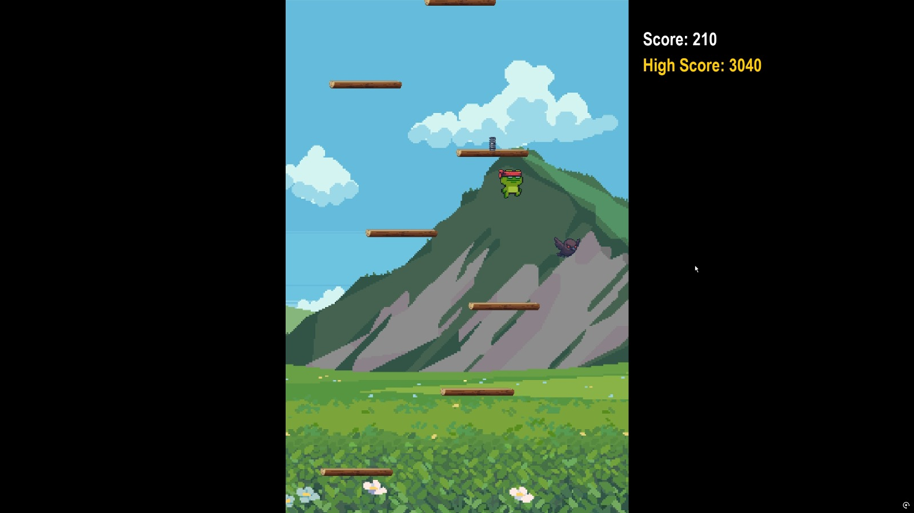
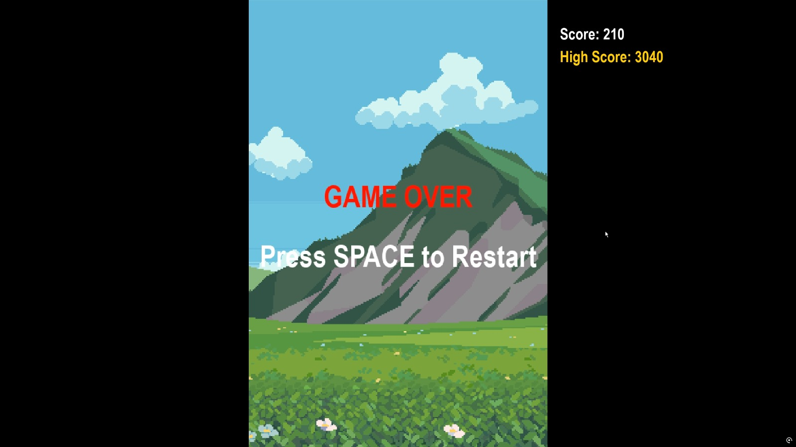

🎮 Jumpy

A Doodle Jump–style game made with Pygame
This is my own version of the classic Doodle Jump game built using Python and the Pygame library.
An infinite vertical platform jumper that has no limits!

---

🧠 Game Logic Summary
->You start by jumping on static wooden platforms.
->Score increases by 10 for every new platform you land on.
->Jumping on a spring gives a big bounce and +50 points.
->Birds start spawning once your score crosses 200.
->If you hit a bird or fall off the screen, it’s game over.
->The game keeps track of your high score in highscore.txt.

---

🚀 Features

->Smooth jumping and movement using gravity.
->Moving platforms.
->Springs that give jump boosts.
->Birds (enemies) that appear as you progress.
->Dynamic difficulty (gravity and platform width increase with score).
->Background music and sound effects .
->High score system that saves between runs.
->Scales automatically to full screen based on your monitor.

---

🕹️ Controls
A	- move left
D	- move right
SPACE - restart after Game Over
ESC	- quit the game

---

🎨 Design Decisions
->Gravity Scaling: I wanted the difficulty to naturally increase, so gravity becomes stronger as your score goes up. It gives the feeling of rising tension without needing separate levels.
->Platform Variety: To keep gameplay from feeling repetitive, I added moving platforms randomly (around 10% chance).
->Birds Unlock with Progress: Birds only start spawning once the player reaches a score of 200. 
->Spring Bonus Points: I made springs give +50 points to make them feel more rewarding, not just functional.
->Fullscreen Scaling: Instead of fixed resolution, the window scales dynamically to the screen size while maintaining the base game ratio.
->Persistent High Score: Used a simple text file (highscore.txt) to store and load the best score.

---

⚔️ Challenges Faced
->Scroll-based Gameplay: Making the camera scroll while keeping the player visually centered required rethinking the score logic and object movement. I had to modify how platforms and background elements move relative to the player’s position.
->Balancing Difficulty: Platform distances and gravity progression had to be recalibrated repeatedly as I tested the game. I tested multiple ranges until the game felt smooth and challenging without being frustrating.
->Score System Redesign: Initially, the score increased based on the number of upward scroll. Later, I switched it to increase as the player jumped on each platform rewarding 10 points.
->Platform Alignment with Spring: Getting the spring to sit perfectly on top of platforms without overlapping or floating was surprisingly tricky. I had to manually adjust its position relative to the platform’s rect multiple times until it looked natural and triggered correctly.
->Bird Spawn Timing: Birds spawning too early made the game unfair, while too late made it boring. I settled on spawning them after a specific score threshold (like 1000) for better pacing.

---

💡 Future Improvements

->Add new power-ups (jetpack, invincibility).
->Main menu and pause feature.
->Multiple backgrounds or themed levels.

